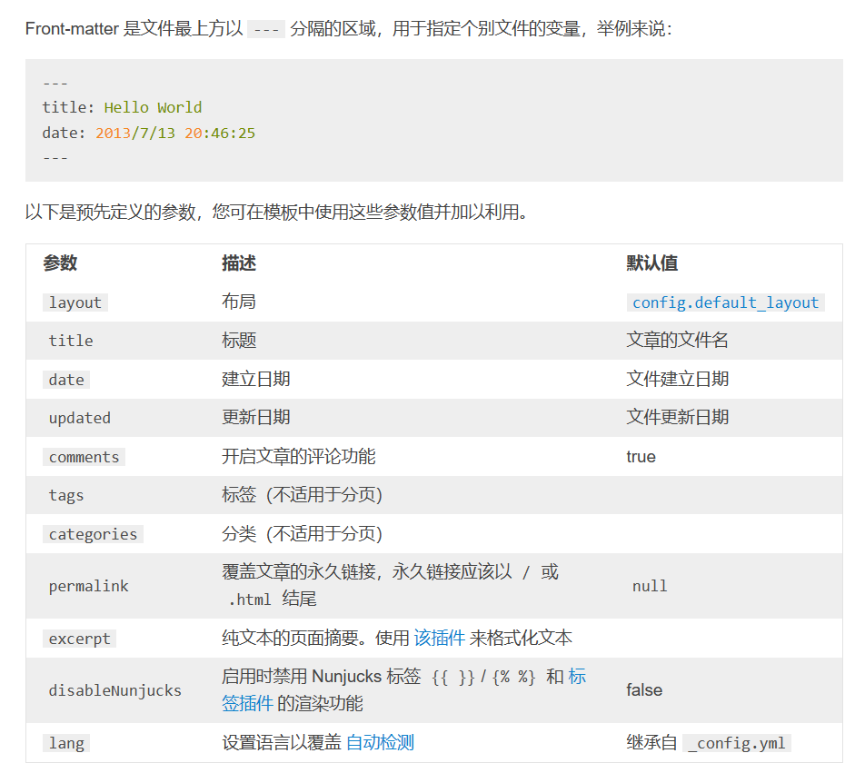

### 1.官网指导：

[Hexo](https://hexo.io/zh-cn/)


目标：学会配置页面，分类，标签，友链

主题：切换大图，文字，网站前图标

进阶：美化，阅读进度，书签等


新建页 hexo new page name

hexo g 生成静态文件

hexo -d 部署

### 2.分类标签



### 2.插入图片

安装插件

```
npm install https://github.com/CodeFalling/hexo-asset-image --save
```

安装后可能\node_modules文件夹下会有一个重复于hexo-asset-image-for-hexo5的hexo-asset-image(也可能是我之前安装的忘删了,这个版本好像有点bug我是用不了)，删掉即可。(不删掉可能会重复处理产生错误的图片地址，最终导致图片无法正常显示)

_config.yml中配置 post_asset_floder为true

在markdown偏好设置中设置图片保存到固定地址 ./${filename}/ 即与文章同名的文件夹下
