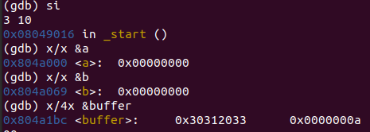

### 各个寄存器解释

- AX：累加器，同时也可用于存放段地址和偏移地址。
- BX：基址寄存器，通常用来存放地址偏移量。
- CX：计数器，用于循环和计数操作，同时也可以存放端口号、中断向量号等。
- DX：数据寄存器，用于存放数据、I/O端口地址等。
- DH：高位寄存器，通常用于存放行号。
- DL：低位寄存器，通常用于存放列号。
- DS：数据段寄存器，用于存放数据段地址。
- ES：附加段寄存器，用于存放字符串传输、数据传输等的段地址。
- SS：堆栈段寄存器，用于存放堆栈段地址。
- SP：堆栈指针寄存器，用于存放堆栈指针的偏移地址。

**esi源地址edi目的地址**

**CS:IP 寄存器**

**CS**是**代码段寄存器**，IP为指令指针寄存器，他们一起合作指向了CPU当前要读取的指令地址，可以理解为CS和IP结合，组成了PC寄存器。

任何时刻，8086CPU都会将CS:IP指向的指令作为下一条需要取出的执行指令。

**ES:BX**在从软盘向内存导入loader时标识目标内存地址，每次读一个扇区，读完bx向后移动一个扇区继续读

### 使用堆栈

用到堆栈首先要初始化堆栈

栈用于暂存数据，以腾出寄存器

### 内存和软盘

软盘的引导扇区其代码部分被加载到内存指定位置

在指令执行时，可以直接mov addr addr，操作内存地址，而对于软盘内容则需要INT中断读写。

INT中断时通过计算磁头 磁道 扇区，将这些信息存到寄存器调用INT中断来访问软盘内容

内存和软盘是两个不同的东西，其**寻址方式**等也不同。内存中一般为连续的32位地址，用基址加偏移量表示。软盘则用磁头 磁道 扇区号表示

### 字符串地址

在lab1.1中的boot中，代码段后面有一个BootMessage,表示字符串地址。其地址与代码段有关，为相对于代码段即cs的相对地址，而非绝对地址。计算时要结合cs内容计算出绝对地址使用

### 中断调用

#### INT 10h             [(55条消息) INT 10H 中断简介_jena_wy的博客-CSDN博客](https://blog.csdn.net/wyyy2088511/article/details/118943120)

**显示器显示**

[(55条消息) 64位操作系统——bootLoader_我是赛赛的博客-CSDN博客](https://blog.csdn.net/qq_17853613/article/details/109127807)

字体颜色（0：黑，1：蓝，2：绿，3：青，4：红，5：紫，6：综，7：白）

**高亮**红底白字白字要用高亮才能显示


**AH** 服务类型

 **AH=09H**:这个功能是在光标位置显示字符，所要显示字符的 ASCII 码存于 AL 寄存器，字符重复次数存于 CX 寄存器，显示页存于 BH 寄存器，属性存于 BL 寄存器，其属性使用与 AH=08/INT 10H 一样。

**AH=0EH**:这个子程序是使显示器像打字机一样的显示字符来

#### INT 13H：

**ah**:服务类型 00h复位 002读扇区 003写扇区

**al**:读取扇区数

**dh**:磁头号

**ch**:柱面号

**cl**:起始扇区号

**es:bx**:接收地址

### org 0100h

org指定程序被载入内存时，程序的起始地址

org指令只会在编译期影响到内存寻址指令的编译(编译器会 把所有程序用到的段内偏移地址自动加上org后跟的数值。引导程序可以看做是被加载到以0为基址的段,偏移为0x7c00的地方

**程序段前缀**是一个操作系统（DOS）概念。当输入一个外部命令或通过EXEC子功能（系统功能调用INT21h，子功能号为4Bh）加载一个程序时，COMMAND确定当前可用内存的最低端作为程序段的起点，也就是程序被加载到内存空间的起点。在程序所占用内存的前256（0100h）个字节中，DOS会为程序创建前缀（PSP）数据区。DOS利用PSP与被加载的程序进行通信。PSP中有程序的返回地址、程序文件名等信息。

### nop指令

**no operation**

作用：

1，通过 nop 指令的填充（nop指令长度从一个字节到九个字节，用于对齐），使指令对齐，从而减少取指令时的内存访问次数。一般用来内存地址偶数对齐，比如有一条指令占 3 字节，这时使用 nop 指令，CPU 就可以从第四个字节处读取指令。

2，清除由上一个算术逻辑指令设置的 flag 位。

3，破解：对于原程序中验证部分使用 nop 来填充，使验证失效。	

### lodsb        ; al <- ds:si 加载内存一个字节到寄存器

### nasm调试[(56条消息) Nasm汇编GDB调试_gdb调试nasm_风神韵的博客-CSDN博客](https://blog.csdn.net/fengshenyun/article/details/116955070)

汇编级别的单步为si, s为C语言级别的

### 查看数据存储



输入3 10\n读到buffer后，由于buffer定义时为db,则为小端字节存储越靠近0x的字节地址越高，0x中每两位为一个字节

0x30312033

从低地址到高地址即为33203130,每个字节对应一个字符

即为3 10

下面一个dword中最低字节为0a,即为\n

### 一些编译调试的指令

```java
//下面的两条指令加上-g用于调试
nasm -f elf32 -g main.asm
ld -g -m elf_i386 main.o -o main 
    
./main用于执行生成的main程序文件
    
gdb main用于调试程序
    
输入后可以输入break+行号设置断点
    
run指令开始运行到输入，或者断点
    
si执行一条指令
    
si num 执行num条指令
    
i r查看当前寄存器内容
    
x/nx address or &标记名称 十六进制查看内容，n表示n个字32位
    
disas 查看当前指令附近的及条指令
    
//在运行的途中可以设置位于当前指令后面的断点，然后跳到相应断点执行
```

